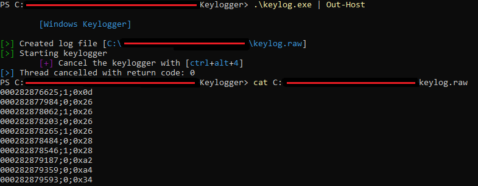

# Windows Keylogger

This keylogger captures all keystrokes in the following format: `timestamp;isReleased;keycode`.

---

### Note

1. Pressed keys will continue to generate *keypress* events until released.
2. The timestamps are the system up-time in milliseconds.
3. The virtual keycodes can be looked up here: https://docs.microsoft.com/en-us/windows/win32/inputdev/virtual-key-codes.

### Building

```
gcc -o keylog.exe -Wall .\keylog.c .\lib_keylog.c
```

### Usage

```
.\keylog.exe
```

Depending on the terminal environment the color codes of the output might not be displayed correctly. Powershell for example has this feature disabled by default. However, getting the colored output can still be achieved using this command in powershell.

```
.\keylog.exe | Out-Host
```

To cancel the keylogger use `ctrl+alt+4`.

### Preview


